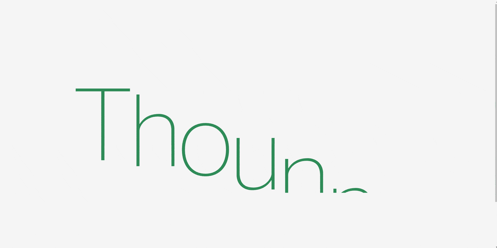

# DAY_016 | Contact Us Page with GSAP and Modal Popup

This project is part of my daily code challenge series, **DAY_016**, where I focus on building a **Contact Us page** featuring a **CSS form design** and a **JavaScript modal popup** triggered by a button click. The project uses **GSAP (GreenSock Animation Platform)** to add animations and smooth transitions to the modal and page elements.

This project was inspired by the Element from **La Pige**. I wanted to replicate the smooth, interactive animations and modal popup effects, using **GSAP**. [Visit the Website](https://la-pige.com/)

## Project Overview

In this project, clicking the "Apply Now" button triggers a modal popup containing a contact form. The form includes fields for name, location, website, and various disciplines. GSAP is used to smoothly animate the form's appearance and transitions, creating an engaging user experience.

---

## Project Preview



## Inspiration


---

## Key Features

- **Modal Popup**: A contact form that appears when the "Apply Now" button is clicked.
- **GSAP Animations**: Smooth entrance and exit animations for both the page elements and the modal popup.
- **Responsive Design**: The page layout adapts to various screen sizes, ensuring a mobile-friendly experience.
- **Form Design**: An interactive form allowing users to input their name, location, website, and check off disciplines they specialize in.

---

## GSAP in Action

### What is GSAP?

**GSAP (GreenSock Animation Platform)** is a powerful JavaScript library used for creating high-performance animations. It allows developers to create complex, smooth transitions and animations with ease.

### How GSAP is Used in This Project

1. **Text Animation**: The header text and "Apply" button animate smoothly into place as the page loads.
2. **Modal Popup Animation**: The contact form modal fades in and out smoothly when the "Apply Now" button is clicked.
3. **Scroll Animations**: Subtle scroll-based animations for other page elements like the tagline and navigation.

---

## JavaScript Implementation

### Modal Popup Logic

The JavaScript in this project controls the behavior of the modal popup, ensuring that it opens and closes with smooth transitions:

#### Toggle Modal Popup

```javascript
const toggleButton = document.querySelector("#toggle");
const toggleButton2 = document.querySelector("#back");
let isOpen = false;

const timeline = gsap.timeline({ paused: true });

timeline.to(".overlay", {
  opacity: 1,
  duration: 0.3,
  pointerEvents: "all",
});

toggleButton.addEventListener("click", function () {
  if (isOpen) {
    timeline.reverse();
  } else {
    timeline.play();
  }
  isOpen = !isOpen;
});

toggleButton2.addEventListener("click", function () {
  timeline.reverse();
  isOpen = false;
});
```

This code listens for the click events on the "Apply Now" and "Back" buttons to toggle the modal's visibility.

---

## How to Run

1. **Clone the repository**:

   ```bash
   git clone https://github.com/thounny/DAY_016.git
   ```

2. **Navigate to the project directory**:

   ```bash
   cd DAY_016
   ```

3. **Open the `index.html` file** in your web browser:

   - You can double-click the file in your file explorer, or
   - Serve it using a local development server (e.g., Live Server in VSCode).

---

## Project Structure

```bash
DAY_016/
│
├── assets/
│   └── you know the rest
│   └── favicon.ico
│   └── DAY_016_1.gif
│   └── DAY_016_2.gif
├── fonts/
│   └── helveticaneue.woff2
├── styles.css
├── index.html
└── script.js
```

---

## Features

- **Modal Popup**: Displays the contact form when triggered by the "Apply Now" button.
- **CSS Form Design**: A simple, elegant form design with input fields for name, location, website, and disciplines.
- **GSAP Animations**: Smooth transitions and animations throughout the page and modal interactions.

---

## Technologies Used

- **HTML5**: For document structure.
- **CSS3**: For layout and styling of the form and page elements.
- **JavaScript (ES6)**: For controlling the modal popup and animations.
- **GSAP (GreenSock Animation Platform)**: For creating smooth, high-performance animations.

---

## Author


**Thounny Keo**  
Frontend Development Student | Year Up United

---


